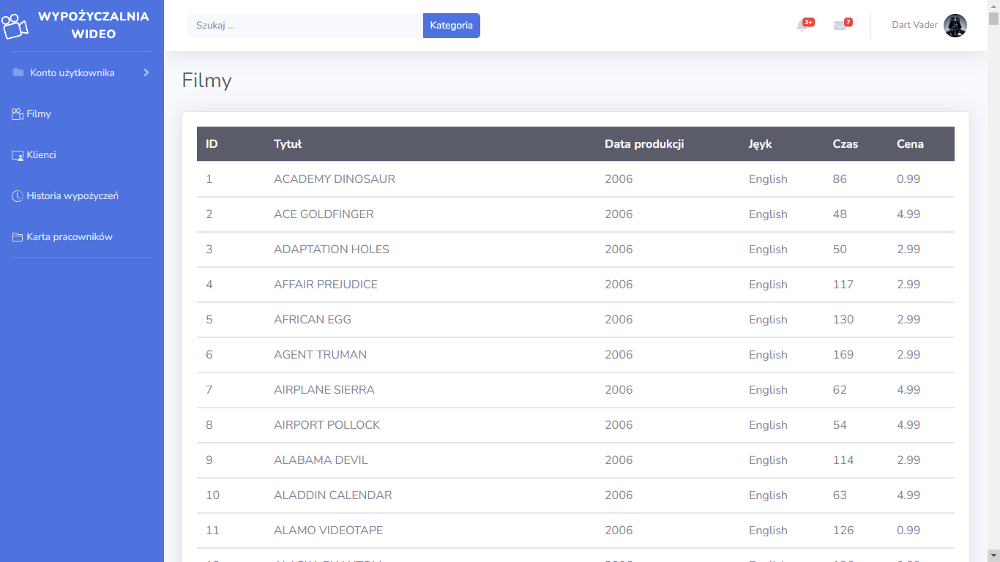

# video-rental - Web app
## The project is being created as part of the INF 04 course.

The project is based on Bootstrap 4 and SB Admin 2 theme and all logic is created in PHP 8.1.6.

## Adding an employee table.

Structureof the employee table.

To add a table with employees to the standard Sakila database import the employee.sql file in the database/ folder. Two sample accounts are created in the table:
Luke Skywalker skywalker@mail.com (password: Abcd1234)
Dart Vader vader@mail.com (password: Abcd1234).

